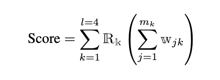
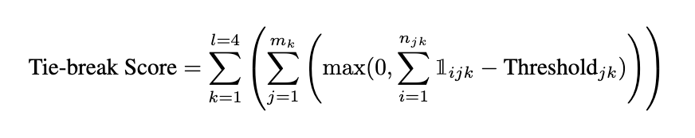
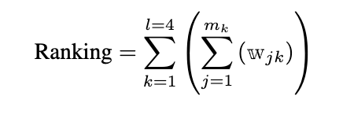

## Open Evaluation

To participate in this competition, you must start with a model from our approved list, utilize only open-source data, and limit any further postprocessing to 24h. This process needs to be carried out on at most 40GB of VRAM with an NVIDIA A100.

## Closed Evaluation

TBD: For the closed evaluation track, the only limitation is that an inference takes less than a few minutes per question

## Datasets:

You are welcome to use any open sourced dataset or create your own dataset as long as you are also willing to open source it. 
You are also allowed to use LLM generated datasets provided the license permits it.
Under no circumstances should you use data that infringes upon data usage agreements, copyright laws, or privacy policies

 

## Evaluation:

The competition comprises 1 practice round and 4 competitive rounds, each featuring 4 to 7 questions. Competitors are required to submit the output of their programs against test cases in plain text format, as specified in each problem. Each submission is scored based on the correctness of its output, compared to "gold" solutions, over a set of predefined test cases that cover various input scenarios, including edge cases.

The results will be ranked in four leaderboards: one for each of the two AI tracks, a human leaderboard for the traditional Hacker Cup competition, and a joint leaderboard comparing AI and human scores concurrently.

**Ranking for AI Tracks**

The ranking used to declare independent winners for each of the two AI tracks, and for awarding sponsor prizes in the Open Track, will be calculated as:

Where:
- `l` is the number of rounds not counting the first practice round,
- `R_k` is the per-round scaling factor of {1, 1.25, 1.5, 1.75} to incentivize higher scores for harder rounds,
- `m_k` is the total number of problems in round `k`,
- `w_{jk}` is the per-problem specific number of points awarded for passing all test cases for problem `j` in round `k`.

We will announce 2 winners for this competition, one for each track above, each corresponding to one competition leaderboard.

**Tie-breaking for AI Tracks**

If multiple competitors have the same score across rounds, we will tie-break using a partial credit system based on the number of test cases that pass:

Where:
- `l` is the number of rounds, not counting the first practice round,
- `m_k` is the total number of problems in round `k`,
- `n_{jk}` is the total number of test cases for problem `j` in round `k`,
- `1_{ijk}` is 1 if the test case `i` for problem `j` in round `k` is passed, 0 otherwise,
- `Threshold_{jk}` is the minimum number of test cases a competitor needs to pass to receive any tie-break score for problem `j` in round `k`. This threshold is problem-dependent and will be announced after each round.

This ensures that a competitor must surpass a certain performance level to qualify for tie-breaking points, with additional points awarded based on the number of test cases correctly solved beyond this minimum requirement.

**Joint Leaderboard**

For informational purposes only, we will jointly rank Human and AI submissions in a single leaderboard. The scoring of AI submissions in this leaderboard will adhere to the same evaluation methodology applied to human contestants in the Hacker Cup. Specifically, credit will only be awarded if all test cases pass for a given problem:

Where:
- `l` is the number of rounds not counting the first practice round,
- `m_k` is the total number of problems in round `k`,
- `w_{jk}` is a problem-specific number of points awarded if and only if all test cases pass for problem `j` in round `k`.

Finally, to foster community-building in this competition, recognition will extend beyond just the top-ranking systems in the two tracks to include a community champion chosen by vote. A voting bot will be implemented to facilitate the communication of upvotes, allowing community members to acknowledge and reward contributions that enhance the collective experience. These contributions can range from releasing base models, developing useful libraries and tools, curating and generating datasets, to publishing tutorials, fixing shared libraries, resolving build issues, and answering questions. At the competition's conclusion, the member with the highest number of upvotes in our Discord (specific platform is subject to change) server, who is neither an organizer nor an advisor of the competition, will be honored as the community champion.